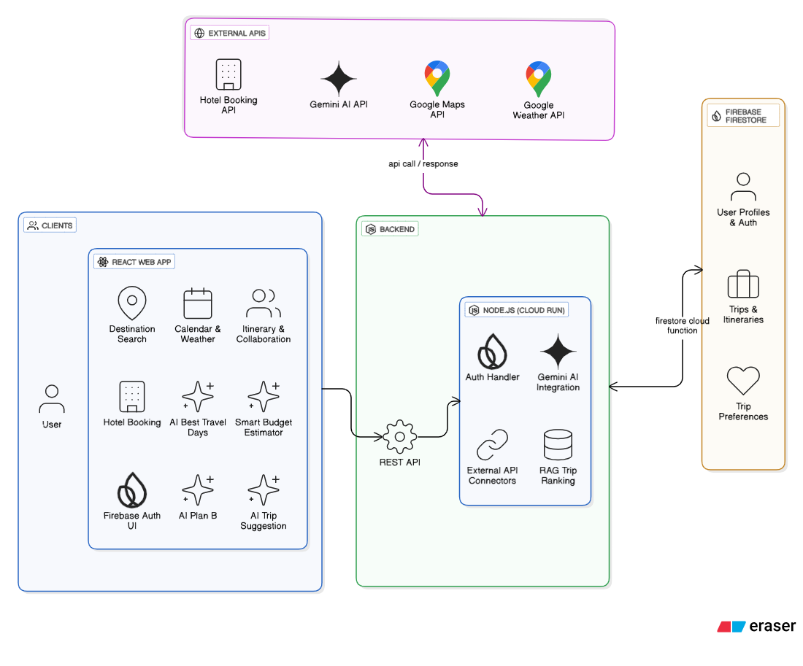

# TripCraft - Your AI-Powered Travel Planner

TripCraft is an intelligent travel planning application that leverages AI to create personalized itineraries based on your mood, budget, and real-time conditions. It simplifies trip planning from discovery to booking.


## ✨ Core Features

-   **AI Itinerary Generation**: Automatically generates detailed, day-by-day travel plans using Google's Gemini AI.
-   **Mood-Based Planning**: Select from moods like "Adventure," "Relax," "Culture," or "Discovery" to tailor suggestions.
-   **AI Budget Estimator**: Get detailed budget breakdowns (budget, moderate, luxury) for your trip.
-   **Weather-Optimized Suggestions**: Recommends the best travel dates based on historical weather data and forecasts.
-   **Interactive Destination Search**: Find and select destinations with a Google Maps-powered search and map view.
-   **Trip Itinerary Collabration**: we can invite mutple users to collabrate for trip.
-   **AI Best Days to travel**: Automatically gives you best days to travel for destination based on forcasted weather.
-   **Booking Integration**: Seamlessly browse and select accommodation options.
-   **AI Plan B for Trip**: On bad weather and some changed in trip Ai will suggest a plan B.
-   **User Authentication**: Secure sign-up and login using Firebase Authentication (Email/Password & Google).
-   **all more features will be added**

## 🧩 Architecture Diagram

## 🛠️ Tech Stack

-   **Frontend**: React, Vite, TypeScript, Tailwind CSS, shadcn/ui
-   **Backend**: Node.js, Express.js, TypeScript
-   **AI**: Google Gemini
-   **Database & Auth**: Firebase (Firestore, Authentication)
-   **External APIs**: Google Maps, WeatherAPI
-   **Deployment**: Google Cloud Run drverless deployment

## 🚀 Getting Started

Follow these instructions to set up and run the project locally.

### Prerequisites

-   Node.js (v18 or later)
-   npm

### 1. Clone the Repository

```bash
git clone <your-repository-url>
cd JourneyGenie
```
## 📁 Project Structure

```
.
├── client/              # React frontend application (Vite)
│   ├── src/
│   │   ├── components/  # Reusable UI components
│   │   ├── lib/         # API calls, Firebase config, types
│   │   └── pages/       # Main page components
│   └── index.html       # Entry point
├── server/              # Express.js backend API
│   ├── ai-service.ts    # Google Gemini integration
│   ├── index.ts         # Server entry point
│   └── routes.ts        # API route definitions
├── shared/              # Shared code (e.g., database schema)
│   └── schema.ts
├── attached_assets/     # Static images and assets
└── vite.config.ts       # Vite configuration
```

### 2. Install Dependencies

```bash
npm install
```

### 3. Set Up Environment Variables

Create a `.env` file in the root of the project by copying the example below. You must provide your own API keys.

```env
# .env

# Google
GOOGLE_MAPS_API_KEY=AIzaSy...
VITE_GOOGLE_MAPS_API_KEY=AIzaSy...
GOOGLE_AI_API_KEY=AIzaSy...

# Weather API
WEATHER_API_KEY=your_weather_api_key

# Firebase - Client (VITE_) and Server
FIREBASE_API_KEY=AIzaSy...
FIREBASE_AUTH_DOMAIN=your-project.firebaseapp.com
FIREBASE_PROJECT_ID=your-project-id
FIREBASE_STORAGE_BUCKET=your-project.appspot.com
FIREBASE_MESSAGING_SENDER_ID=...
FIREBASE_APP_ID=1:...
FIREBASE_MEASUREMENT_ID=G-...

VITE_FIREBASE_API_KEY=AIzaSy...
VITE_FIREBASE_AUTH_DOMAIN=your-project.firebaseapp.com
VITE_FIREBASE_PROJECT_ID=your-project-id
VITE_FIREBASE_STORAGE_BUCKET=your-project.appspot.com
VITE_FIREBASE_MESSAGING_SENDER_ID=...
VITE_FIREBASE_APP_ID=1:...
VITE_FIREBASE_MEASUREMENT_ID=G-...
```

### 4. Run the Development Server

This command starts both the frontend and backend servers concurrently.

```bash
npm run dev
```

The application will be available at `http://localhost:8080`.


## 🏗️ Build & Deployment

### 🚀 Deploy on Google Cloud Run

Follow these steps to deploy your app to **Google Cloud Run**:

---

### 1. Authenticate & Set Project
```bash
# Login to Google Cloud
gcloud auth login

# Set your project ID
gcloud config set project <YOUR_PROJECT_ID> 
```
### 2. Deploy
```bash
export GOOGLE_MAPS_API_KEY="YOUR_GOOGLE_MAPS_API_KEY"
export WEATHER_API_KEY="YOUR_WEATHER_API_KEY"
export GOOGLE_AI_API_KEY="YOUR_GOOGLE_AI_API_KEY"

export FIREBASE_API_KEY="YOUR_FIREBASE_API_KEY"
export FIREBASE_AUTH_DOMAIN="YOUR_FIREBASE_AUTH_DOMAIN"
export FIREBASE_PROJECT_ID="YOUR_FIREBASE_PROJECT_ID"
export FIREBASE_STORAGE_BUCKET="YOUR_FIREBASE_STORAGE_BUCKET"
export FIREBASE_MESSAGING_SENDER_ID="YOUR_FIREBASE_MESSAGING_SENDER_ID"
export FIREBASE_APP_ID="YOUR_FIREBASE_APP_ID"
export FIREBASE_MEASUREMENT_ID="YOUR_FIREBASE_MEASUREMENT_ID"
export PORT="8080"

# Ensure SERVICE_NAME is set in your env
export SERVICE_NAME="YOUR_SERVICE_NAME"

  
gcloud run deploy "$SERVICE_NAME" \
  --source . \
  --set-env-vars GOOGLE_AI_API_KEY="$GOOGLE_AI_API_KEY" \
  --set-env-vars WEATHER_API_KEY="$WEATHER_API_KEY" \
  --set-env-vars GOOGLE_MAPS_API_KEY="$GOOGLE_MAPS_API_KEY" \
  --set-env-vars FIREBASE_API_KEY="$FIREBASE_API_KEY" \
  --set-env-vars FIREBASE_AUTH_DOMAIN="$FIREBASE_AUTH_DOMAIN" \
  --set-env-vars FIREBASE_PROJECT_ID="$FIREBASE_PROJECT_ID" \
  --set-env-vars FIREBASE_STORAGE_BUCKET="$FIREBASE_STORAGE_BUCKET" \
  --set-env-vars FIREBASE_MESSAGING_SENDER_ID="$FIREBASE_MESSAGING_SENDER_ID" \
  --set-env-vars FIREBASE_APP_ID="$FIREBASE_APP_ID" \
  --set-env-vars FIREBASE_MEASUREMENT_ID="$FIREBASE_MEASUREMENT_ID" \
  --verbosity=debug

```

## 📄 License

This project is licensed under the MIT License. See the [LICENSE](LICENSE) file for details.